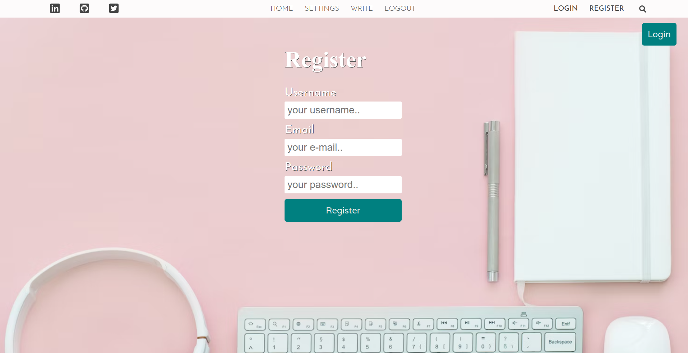
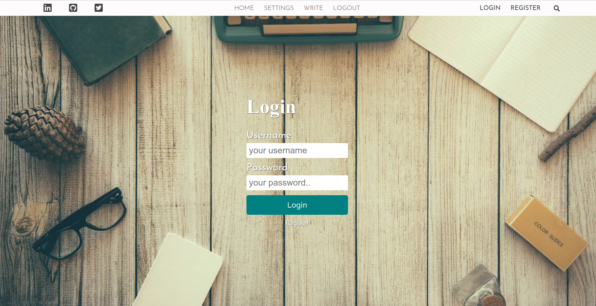
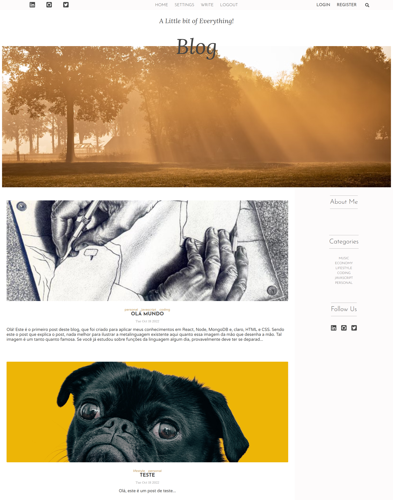
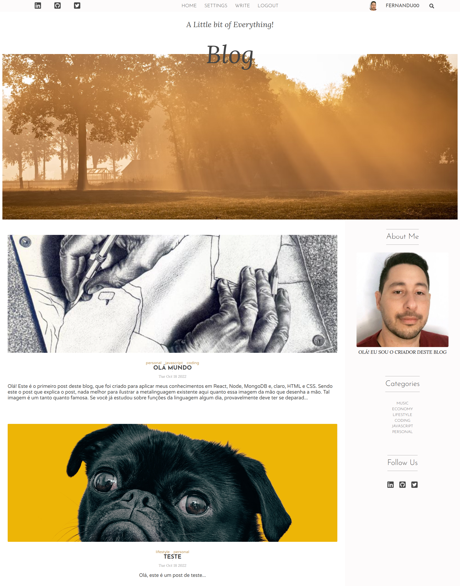
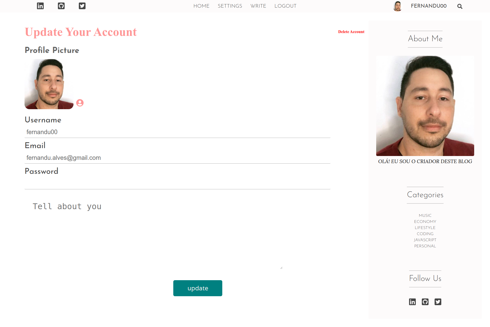
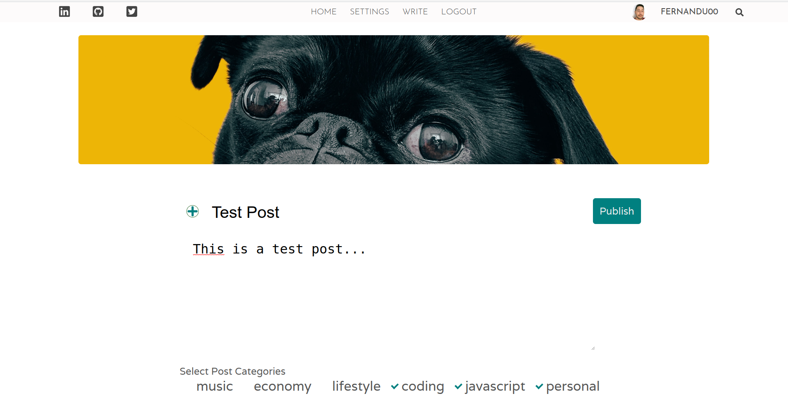
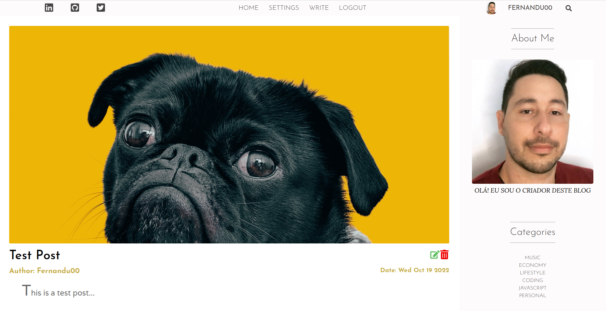

# Blog Full Stack Application

This is a blog application project made in order to practice all the content I've studied so far. To develop this blog I've used several different technologies. To the frontend I've used React, React Router and Context API to set public and private routes, axios to make api calls besides HTML and CSS for styling. For the database I've used mongoose as a ODM to model the mongoDB database. The documents are stored in AtlasDB. In the backend I've used NodeJs and Express to create the api routes, endpoints and the controllers using bcrypt to hash passwords and compare in the login controller. To handle the image files I've used the multer middleware alongside with Firebase storage to upload the image files, generate the file links and store in the mongoDB database.

## Overview

### The funcionalities

Users should be able to:

- View the layout in the desktop and tablet screen dimensions. I haven't done the mobile design because I wouldn't use an app like this in smaller screens and I wanted to practice my NodeJs skills in this project.
- Create, read, update, and delete users, posts and categories,
- Register a new user with username, email and password,
- Login with backend validation,
- Edit user's profile with username, email, password, profile picture and about text.

# Screenshots

## Register Page

## Login Page

## Home Page without user login in

## Home Page with logged user

## Settings Page

## Write Post Page

## Single Post Page

### Links

- Live Site URL: (https://fernandu00-blog.netlify.app/)

### Built with

- React
- React Router
- Context API
- Axios
- Express
- bcrypt
- multer
- MongoDB
- Firebase

## Author

- LinkedIn - (https://www.linkedin.com/in/fernando-de-paula-alves-profile/)
